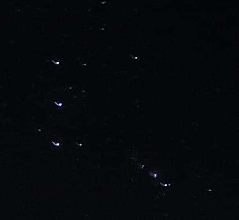

Get ready to look like the biggest nerd at this year's New Year's Party.

### First, some terms - 

- Aperture - 

    Aperture is **the amount of light you let into your sensor**, usually via adjusting how much of the lens is covered. Wider lenses with a bigger surface area can capture more light, and hence have bigger apertures.

    The fundamental problem with photographing stuff in the night sky is light. Even the brightest thing in the night sky, like the moon, is incredibly dim as compared to the Sun. The stars and fireworks are even dimmer.
    
    
<picture>
        
    </picture>
 

    Your eyes can dynamically change their aperture -  Your phone camera, in most cases, can't - And has to resort to other techniques that we'll see below.

- Capture speed (Also called Shutter Speed) -

    Capture speed is **how long you capture light for.** Higher capture speeds obviously capture more light.

    Imagine you are a painter with a blank canvas. You can only flick color on your canvas from afar. The more times you flick, the more color there is on the canvas. The less times you flick, the more "well-defined" the edges of your splatters are. This is similar to how your camera operates. It takes instantaneous pictures, and stacks them over each other for a given amount of time. This time is the Capture Speed. 

    As you can imagine, mobile phones like to minimize this number, because people have shaky hands. For a crisp photo, you want this number to be as small as possible.

     Nerd fact: Back in the old days, this used to be governed by how fast you can open and close your film to light - how fast your shutter is. Hence, the name shutter speed, which persists to this day, in spite of fully electronic cameras.

- ISO - 

    Your camera has a tiny silicone grid inside - One that reads the amount of light falling on it at each point, and gives your phone three pixel-maps - Red, Green and Blue.

    Of course, as is anything designed by humans, it's not perfect - and it picks up some noise alongside actual data. The value given to your phone at any given pixel is - 

    
 Output = Constant * (Data + Noise) 
 
    
    This constant is (correlated to) the ISO.

     Nerd fact: This number is actually not the number your camera multiplies. In fact, the term is a leftover from film photography. The constant is tuned by your sensor manufacturer at every pixel to give similar "Ouput levels" to film with a particular grain size. 

- Exposure - 

    Exposure is similar to ISO, but it is applied during post-processing. While the ISO is applied at any given moment to every pixel, the Exposure is applied to the entire image formed by your camera, all at once, after the Image is formed.

    You will see why the difference is meaningful later.

### How do you take a good photo during the night (normal people edition)

1. Open your normal camera app, and switch to pro mode. The night mode might work, but we can do better.

2. Set your phone down on a tripod or a stable place, such that you can see the spot of sky you want to photograph.

3. If there's an aperture option, crank it as high as it goes.

4. Set the ISO to 400, and the Shutter Speed to 1 second. Take a test photo.

5. If you are holding the phone and the photo is shaky, or if it has streaks, reduce the shutter speed by half and double the ISO and repeat as necessary.

6. If the photo is too dim, increase the shutter speed by a factor of 2. Repeat as necessary.

You should now have a bunch of settings that take excellent night photos from your camera.

### How do you take a good photo during the night (nerd edition)

Every "night mode" will crank your ISO and exposure to minimize shutter speed, because it presumes you will be holding the phone in your shaky hand. A high ISO and exposure image also cranks up the noise, and your image will look washed out and blurry.

We will avoid this problem by setting our phone in a stable place, or using a tripod. We will then switch to the manual mode or pro mode in our camera, to get complete control over all the parameters.

Now, we need a starting point and a bunch of trial and error, since every camera is different. I start by setting my ISO to 400 and my shutter speed to one second. Now, if I have an aperture control, I crank it as high as it goes. It is the one thing with basically no downside.

We will now take a photo. It should be pretty alright. Now, we will continue increasing our aperture until we reach something like this - 

<picture>
    
</picture>
 

This is an extreme close-up, but you can see how the stars have a little "tail." This is not your fault, this is literally the earth rotating as you photograph. The only way to fix it is to reduce your shutter speed. And so we will, until this tail is no longer noticeable.

Now, you must make a judgement - Turn up your screen brightness, and check if you can see any more stars. If yes, increase your ISO until that's no longer the case, but try to keep your ISO relatively low. A high ISO with a long shutter speed can cause flaws in your sensor to add up. Exposure does not do this, but it causes your image to be washed out. You decide how much these stars matter, and how much ISO and exposure you want to add.

As for fireworks, the same rules apply. Higher shutter speeds mean you are less likely to "miss the moment", but also more likely to get nothing but a white screen, so reduce your ISO and exposure accordingly.

Now go forth, and take incredible looking photos of the night sky!

 Nerd note: This, however, is not how most pictures of the night sky you see on the internet are taken! They use something called "stacking" where you can virtually increase the shutter speed without any upper bounds with potentially no trailing, but that's a topic for another time. 

If you liked this post, consider [supporting me!](https://support.ofdisorder.de)