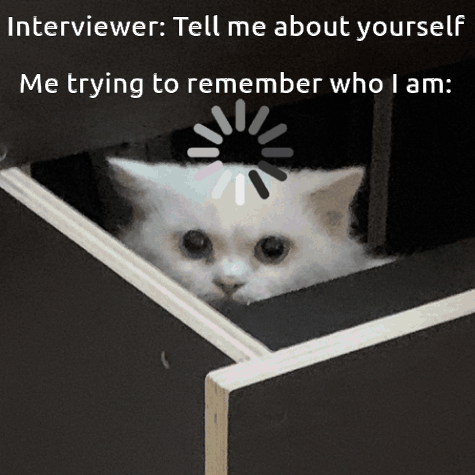

I don't know what the format for these blog posts will be, but this seems like a good platform to try and justify my philosophy.

Ever since I was a little teensy kid, I was told by my guardians to "stop overthinking" - as if that sentence has ever made someone stop - and to "not make things more complicated than they are." And, that led to me overthinking about overthinking. And human existence. And why capitalism is a parody of the human condition.

###  But Artemis, what is a human?

This is such a basic question, one that we must explore to explain "Why do humans think?" and then to answer "Is thinking bad?" And the scientific definition of 'Homo Sapiens' doesn't help us either. So, for the sake of this post, let us think from the ground up. Imagine you're an alien coming from a different planet, trying to figure this question out. You might ask yourself - What do humans do? What do they enjoy? *What makes them unique?*

And, *voila.* We arrive at our first observation - Humans are bound together by a society. They **socialize**. They talk to each other and spend time together - they build their entire lives around each other! “But why!" we must ask ourselves. What do individual humans have that makes them unique? That makes this "Artemis" not replaceable with just any other human woman?

The answer, of course, is their experiences. And subsequently, the way they express these experiences - how they think. That is our second observation - Human thoughts are way more complex than any other social animal. Even if you put another animal through the same experiences, a human can extract a lot more *juice* out of it. They can take the same experience and turn it into a million more experiences by sharing it.

Thus, our alien mind will form a firm picture: **humans are thought machines. They spend their life either sharing thoughts, forming them or collecting new experiences to reflect in these thoughts.**
    

<picture>
    
</picture>
 u/shenanigansen on reddit. Open the picture to be redirected. 

### If thinking is good, why does it make me sad?

As a kid, I used to pray to any cosmic force that'd listen. I prayed for them to make me blissfully unaware of everything going on around me. Make me able to truly live life "one day at a time." But, since this post exists, you know that never happened.

So now, it falls into our hands to explain why - why overthinking feels so bad. Let us hop into the alien perspective again and analyze humans some more. It is time to overthink about overthinking.

We can use the pigeonhole principle to suggest that since every human is connected to at least a few others, all of them must be connected somehow. However, a scan of their brains shows they don't have nearly enough memory to remember every human they've shared an experience with! We observe that humans, with their limited minds can *only remember a small number of people in detail.*

So what do people do with the people they don't remember in detail? They only remember the most "thought-provoking" part of the person. The part they can form thoughts for themselves out of. This ends up with them having only the most *"impressive"* side of people in their memory. Recognizing this, humans want to be "impressive" themselves - *to be remembered.*

<picture>
    
</picture>
 

What's worse is that humans recognise their own mortality. They strive to become "impressive" as soon as possible - often dreading the future. As a result of this, we arrive at our final observation - **Humans are afraid of failure.** 

Furthermore, our fear for the future makes thinking about it more complex than just forming thoughts based on past experiences. When you think about a future scenario, you don't just think about one set of circumstances. Instead, you will think of every combination of circumstances, actions, and outputs that you can imagine - based on all of the experience that you have collected. 

Some of these scenarios, unfortunately, will involve failure. Your brain, mortifired of these, will examine the scenario again and again - not caring about the *probability* of failure, but its *presence*. This is the overthinking loop - the presence of failure in the future making you feel like you have failed already.

It's not thinking that makes you sad. *It's thinking about failure that makes you sad.* And this is the exact fact used to exploit the working class.

### Artemis rants about Capitalism.

Imagine if, in a world where humans are *physically* programmed to be afraid of failing, the majority of the world mandated a system where - if you were born in 99% of the population - you were guaranteed to be unfulfilled.

Imagine if the same system forced every single thought you had into a machine, built to replicate your thoughts, so that your experiences and your existence was reduced to data on a chip - where every mark of individuality can be "polished" away, while you and your habitat are forced to suffer by the same people wiping you away.

Imagine if you saw people around you - the same people you hold the prettiest experiences with - turning into mindless husks, trying to satisfy the system. The people that had previously shared every single thought with you, not having the *energy* to talk to you, much less share their experiences.

Imagine if you were called a lunatic for calling the system wrong - asked to "Stop thinking about it" and accept it for what it is.

Never stop thinking.

---

If you liked this post, consider [supporting me!](https://support.ofdisorder.de)